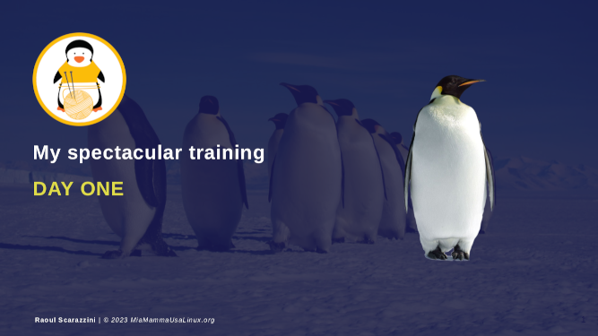
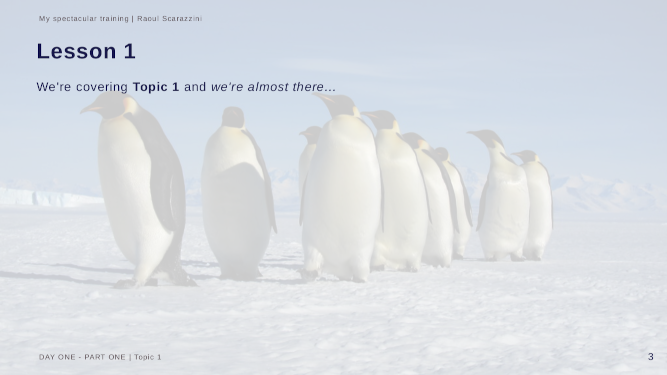

# KPA - The Knowledge Pods Approach

This repository defines the **Knowledge Pods Approach** (**KPA**), an agile way to create, maintain and evolve training materials and presentations using standard [Markdown](https://en.wikipedia.org/wiki/Markdown) files to create beautiful slide sets.

## What is a KPA project?

A **KPA project** is a set of variables and Markdown files that are used by the Ansible role named [kpa_marp_slides_generator](https://github.com/mmul-it/kpa_marp_slides_generator) to automate the creation of a single Markdown file that can be processed using [Marp (Markdown Presentation Ecosystem)](https://marp.app/#get-started) to obtain a set of slides in the usual presentation formats like **html**, **pdf** and **ppt**.

**KPA** makes it possible to control all the knowledge in a standard and "edit from everywhere" way, making it easy to compose and mix the set of topics you want to include into the training, by creating sequences of **Knowledge Pods** (**KP**).

## What is a Knowledge Pod?

A **Knowledge Pod** (**KP**) is the smallest part you can split a section of a training or of a presentation.

You can imagine it as a chapter. For example, if you need to deliver a training named "**How to use my technology**" in which you'll have to cover an **introduction** to your technology, the **prerequisites**, the **installation** and finally **day 0 operation**, then each one of these chapters would be a Knowledge Pod, like:

- *Introduction.md*

- *Prerequisites.md*

- *Installation.md*

- *Day-0-operations.md*

A **Knowledge Pod** should have, uniformly, the same duration (say one hour), so that it will be easy to compose a training by picking the needed KP.

Each section of a **Knowledge Pod**, say a paragraph, is separated from the other with the `---` Markdown element, which represents a new slide.

## What are the benefits of adopting KPA?

There are several benefits using KPA:

- **Concentrate <u>just</u> on the contents**: once you have defined your project, you don't need to care about anything but writing Knowledge Pods. No no need to manually syntax highlight your code blocks, no need to adapt text, no need to duplicate your slide to modify just a simple sentence.
  Just write your Knowledge Pods in Markdown, and you're good to go.

- **Compose training and presentations <u>dynamically</u>**: no more Power Point slides cut and paste. You can combine your Knowledge Pods in the way that fits your needs, creating as many variants of your training and presentations as you need.

- **Have the same look & feel for <u>every</u> training or presentation**: no more "*Ok, now you need to apply this new slide format to all our 100 presentations*". You will define your project look & feel one time and it will be applied everywhere, always the same way.

- **Use a <u>standard</u> and <u>reusable</u> format**: the same documentation you will produce with KPA could be used wherever you want, it's Markdown, it's a standard, you will be able to write your own tool to manage your **Knowledge Pods**.

- **Keep everything versioned and <u>in order</u>**: once you'll store your KPA projects in a Git repository you'll get versioning, monitor of the changes and your entire knowledge in one traceable place.

- **Let everyone <u>do their job</u>**: Markdown is simple, even non-technical people can edit Knowledge Pods, so everyone can do their job: graphics can work on the themes, instructors can write the contents and you, the **KPA master ©**, will put everything together.

## Create a KPA project

After cloning this repository you'll see a `projects` directory, meant to contain all your KPA projects. You can use `example` project as your starting point.

This is the structure of a **KPA project**:

```console
projects/example/
├── theme.css
├── images
│   ├── chapter-background.png
│   ├── cover-background.png
│   ├── logo.png
│   └── slide-background.png
├── slides-settings.yml
├── templates
│   ├── chapter.md.j2
│   └── cover.md.j2
├── contents
│   ├── Topic-1.md
│   ├── ...
│   └── Topic-18.md
└── Example-Training-01.yml
```

Where:

- [theme.css](example/theme.css) is the css theme file that overrides Marp's default theme. This is not needed, you can use a [predefined Marp theme]([marp-core/themes at main · marp-team/marp-core · GitHub](https://github.com/marp-team/marp-core/tree/main/themes)).

- [images](projects/example/images/) contains backgrounds, logos and all the useful graphics elements for the slides.

- [slides-settings.yml](projects/example/slides-settings.yml) contains the general presentation parameters that will override role's defaults:
  
  ```yaml
  ---
  
  kpa_project_dir: 'projects/example'
  
  marp_theme: example
  marp_background_color: #ffffff
  marp_background_image: "{{ kpa_project_dir }}/images/slide-background.png"
  marp_author: 'Raoul Scarazzini'
  marp_copyright: '© 2023 MiaMammaUsaLinux.org'
  marp_paginate: true
  
  marp_cover_template: "{{ kpa_project_dir }}/templates/cover.md.j2"
  marp_cover_image: "{{ kpa_project_dir }}/images/cover-image.png"
  marp_cover_logo: "{{ kpa_project_dir }}/images/logo.png"
  marp_cover_background_image: "{{ kpa_project_dir }}/images/cover-background.png"
  
  marp_chapter_template: "{{ kpa_project_dir }}/templates/chapter.md.j2"
  marp_chapter_background_image: "{{ kpa_project_dir }}/images/chapter-background.png"
  ```

- [templates](projects/example/templates/) contains the templates for the special slides that will be processed by Ansible. These templates will parse the variables, to be reusable. For example, the [chapter.md.j2](projects/example/templates/chapter.md.j2) contains the layout for the slide that will be shown at the beginning of each KP/Chapter:
  
  ```markdown
  ---
  
  <!-- _backgroundImage: url({{ marp_chapter_background_image }}) -->
  
  # <span class="txt-yellow">{{ slide.title }}</span>
  
  <span class="txt-yellow">{{ slide.chapter }}</span>
  ```
  
  The variables used in this file can be declared globally (like `marp_chapter_backgroundImage`, see [slides-settings.yml](projects/example/slides-settings.yml)) or specifically (like `slide.title`, see [Example-Training-01.yml](projects/example/Example-Training-01.yml)).

- [contents](projects/example/contents/) contains the **Knowledge Pods** in the [Marp Markdown compatible format](https://marpit.marp.app/markdown) (The main rule: `---` is the beginning of a new slide).

- [Example-Training-01.yml](projects/example/Example-Training-01.yml) is the slides set declaration, it contains the structure of the document, in a list element:
  
  ```yaml
  ---
  marp_title: "My spectacular course"
  
  marp_slides:
    # DAY 1
    - cover: true
      title: "{{ marp_title }}"
      subtitle: "DAY ONE"
    - chapter: 'DAY ONE - PART ONE'
      title: 'Topic 1'
      content: "{{ kpa_project_dir }}/contents/Topic-1.md"
    - chapter: 'DAY ONE - PART TWO'
      title: 'Topic 2'
      content: "{{ kpa_project_dir }}/contents/Topic-2.md"
      ...
      ...
    # Day 2
    - cover: true
      title: "{{ marp_title }}"
      subtitle: "DAY TWO"
    - chapter: 'DAY TWO - PART SEVEN'
      title: 'Topic 7'
      content: "{{ kpa_project_dir }}/contents/Topic-7.md"
      ...
      ...
    # Day 3
    - cover: true
      title: "{{ marp_title }}"
      subtitle: "DAY THREE"
    - chapter: 'DAY THREE - PART THIRTEEN'
      title: 'Topic 13'
      content: "{{ kpa_project_dir }}/contents/Topic-13.md"
      ...
      ...
    - chapter: 'DAY THREE - PART EIGHTEEN'
      title: 'Topic 18'
      content: "{{ kpa_project_dir }}/contents/Topic-18.md"
  ```

## Create the Marp Markdown file with `kpa_marp_slides_generator.yml`

To start using the `kpa_marp_slides_generator` Ansible role you first need to install it, you can use `ansible-galaxy`:

```bash
> ansible-galaxy install -r roles/requirements.yml --roles-path ./roles
Starting galaxy role install process
- downloading role 'kpa_marp_slides_generator', owned by mmul
- downloading role from https://github.com/mmul-it/kpa_marp_slides_generator/archive/main.tar.gz
- extracting mmul.kpa_marp_slides_generator to /home/rasca/Git/mmul-it/kpa/roles/mmul.kpa_marp_slides_generator
- mmul.kpa_marp_slides_generator (main) was installed successfully
```

Then it's time to to execute, via `ansible-playbook` command the Ansible playbook named `kpa_marp_slides_generator.yml`, passing the **KPA Project** variables related to the general slides settings (`-e @projects/example/slides-settings.yml`) and to the specific training (`-e @projects/example/Example-Training-01.yml`) :

```bash
> ansible-playbook \
    -e @projects/example/slides-settings.yml \
    -e @projects/example/Example-Training-01.yml \
    kpa_marp_slides_generator.yml
[WARNING]: No inventory was parsed, only implicit localhost is available
[WARNING]: provided hosts list is empty, only localhost is available. Note that the implicit localhost does not match 'all'

PLAY [localhost] *********************************************************************************************************************************************************

TASK [marp-slides-creator : Creating the template] ***********************************************************************************************************************
changed: [localhost]

PLAY RECAP ***************************************************************************************************************************************************************
localhost                  : ok=1    changed=1    unreachable=0    failed=0    skipped=0    rescued=0    ignored=0
```

This command will generate a file named `slides.md` in the `slides` directory, as declared in the `marp_output_file` variable (see [projects/example/slides-settings.yml](projects/example/slides-settings.yml)).

## Create the presentation from the Marp Markdown file

To get a presentation with the Markdown file generated by the `marp-slides-creator` Ansible role you can use the [Marp container](https://hub.docker.com/r/marpteam/marp-cli), like this:

```bash
> docker run \
    --rm \
    -e LANG=$LANG \
    -e MARP_USER=$(id -u):$(id -g) \
    -v $PWD:/home/marp/app/ \
    marpteam/marp-cli \
      --html true \
      --theme ./projects/example/theme.css \
      slides/slides.md 
[  INFO ] Converting 1 markdown...
[  INFO ] slides/slides.md => slides/slides.html
```

`Marp` supports exporting in `pdf`, `html` and `ppt`, you might want to remember the `--allow-local-files` when exporting into static files like `pdf` and `ppt`.

### Results

The `marp-cli` execution should produce these set of slides:

- Cover:
  

- Chapter:
  

- Slide:
  

**Important note about exporting into `html`**: the destination directory of your file should contain the images, `.css` and so on since it will process them "live", this is why you will find a symbolic link pointing to your KPA projects directory inside the `slides` output directory:

```console
> ls -la slides/
total 3196
drwxrwxr-x 2 rasca rasca    4096 gen 17 18:37 .
drwxrwxr-x 7 rasca rasca    4096 gen 17 18:30 ..
lrwxrwxrwx 1 rasca rasca      10 gen 17 18:37 projects -> ../projects
-rw-r--r-- 1 rasca rasca  144942 gen 17 17:27 slides.html
-rw-rw-r-- 1 rasca rasca   11874 gen 17 17:27 slides.md
-rw-r--r-- 1 rasca rasca 3102777 gen 17 18:29 slides.pdf
```

If you want to change the destination of your `.html` slides, remember that you will need the projects directory (or a link) in there.

### Themes

For the Example training a custom css (check [projects/example/theme.css](projects/example/theme.css)) has been created to give a sample on how the look & feel might be changed.

The theme can be integrated with the various tools available for Marp:

- [Marp for VS Code extension](https://marketplace.visualstudio.com/items?itemName=marp-team.marp-vscode): In the `settings.json` file
  
  ```json
  {
    "markdown.marp.themes": ["./projects/example/theme.css"],
    "markdown.marp.enableHtml": true
  }
  ```

- With the [Marp CLI](https://github.com/marp-team/marp-cli)
  
  ```bash
  > docker run \
    --rm \
    -e LANG=$LANG \
    -e MARP_USER=$(id -u):$(id -g) \
    -v $PWD:/home/marp/app/ \
    marpteam/marp-cli \
      --html true \
      --theme ./projects/example/theme.css \
      --pdf \
      --allow-local-files \
      slides/slides.md
  ```
